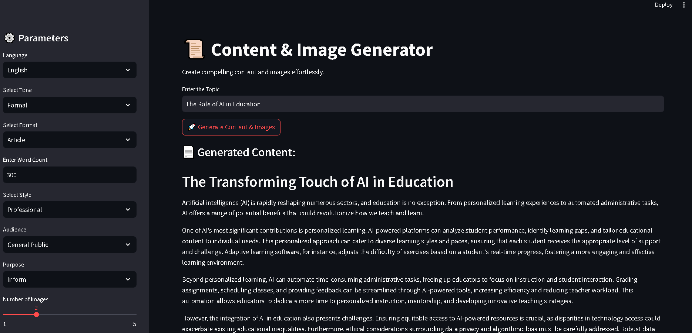

# Content & Image Generator



**Content & Image Generator** is a powerful Streamlit-based web application that combines cutting-edge language models and image generation technology. It generates dynamic text content using the **Google Generative AI model** and creates images using **Stable Diffusion via the Hugging Face API**. Users can then download both the generated content and images as a DOCX file for convenience.

## Key Features

- **Content Generation with Google AI**: Uses the Google Generative AI model to automatically generate text based on user-defined parameters like topic, tone, style, audience, and purpose.
- **AI-Driven Image Generation with Hugging Face**: Leverages the Stable Diffusion model from Hugging Face to generate images that complement the generated content’s topic and style.
- **DOCX Export**: Combines generated content and images into a downloadable DOCX file for easy sharing and use.

## Installation Guide

Ensure Python 3.10 or higher is installed before following these setup steps:

### Step 1: Clone the Repository

Clone the repository to your local machine:

```bash
git clone https://github.com/PriyanshuDey23/ContentImageGenPro.git
```

### Step 2: Install Dependencies

Navigate to the project directory and install all required dependencies:

```bash
cd <project-directory>
pip install -r requirements.txt
```

### Step 3: Set Up Environment Variables

Create a `.env` file in the root directory of the project and add the following environment variables:

```bash
GOOGLE_API_KEY=<your-google-api-key>
HUGGING_FACE_API_KEY=<your-hugging-face-api-key>
```

Replace `<your-google-api-key>` and `<your-hugging-face-api-key>` with your respective API keys for the **Google Generative AI** and **Hugging Face** services.

### Step 4: Launch the Streamlit App

Run the Streamlit application using the following command:

```bash
streamlit run app.py
```

This command will open the app in your default web browser, where you can begin generating content and images.

## How to Use

1. **Enter Topic**: Provide a topic for the content you'd like to generate.
2. **Select Parameters**: Use the sidebar to select the desired settings:
   - **Language**: Choose the language for the generated content.
   - **Tone**: Pick the tone (e.g., formal, conversational).
   - **Content Format**: Choose from formats like article, blog post, social media post, or specify your own.
   - **Word Count**: Set the desired word count for the generated content.
   - **Style**: Pick a style such as professional, creative, or technical.
   - **Audience**: Specify the intended audience (e.g., students, industry professionals).
   - **Purpose**: Define the purpose of the content (e.g., inform, educate, persuade).
   - **Number of Images**: Choose how many images to generate for the content.

3. **Generate**: After adjusting the settings, click "Generate" to see the content and images.
4. **Download**: Once the content and images are generated, click the "Download as DOCX" button to save them as a DOCX file.

## Contributing

Contributions are welcome! If you have ideas or improvements, feel free to submit a pull request.

## License

This project is licensed under the MIT License. For more details, see the [LICENSE](LICENSE) file.

## Acknowledgements

Special thanks to the following technologies:

- **[Streamlit](https://streamlit.io/)**: For building interactive web applications.
- **[Google Generative AI](https://developers.google.com/ai/)**: For providing a powerful text generation model.
- **[Hugging Face](https://huggingface.co/)**: For offering the Stable Diffusion model for image generation.
- **[Pillow](https://pillow.readthedocs.io/)**: For image processing capabilities.
- **[Langchain](https://langchain.com/)**: For seamless integration of language models into the application.
